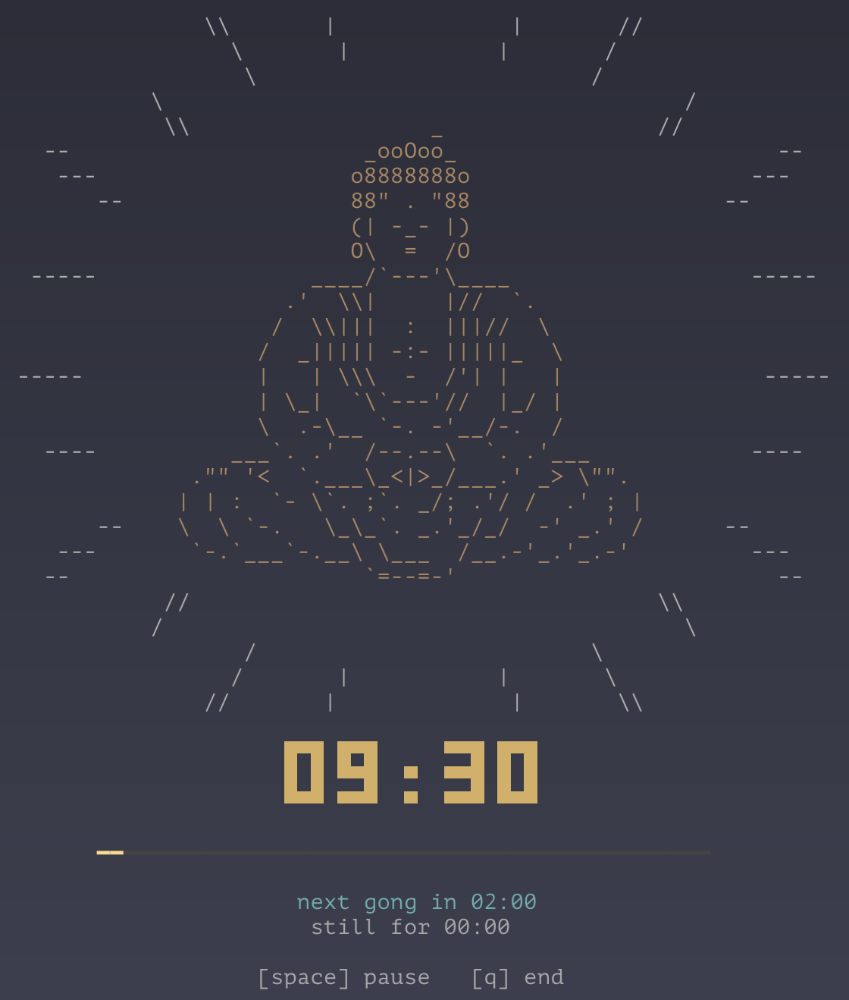
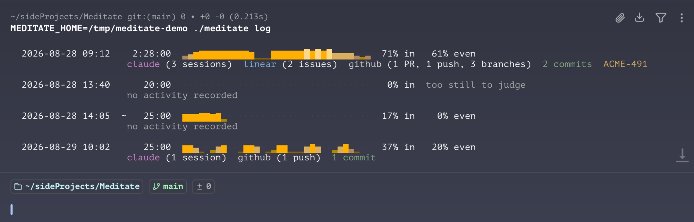
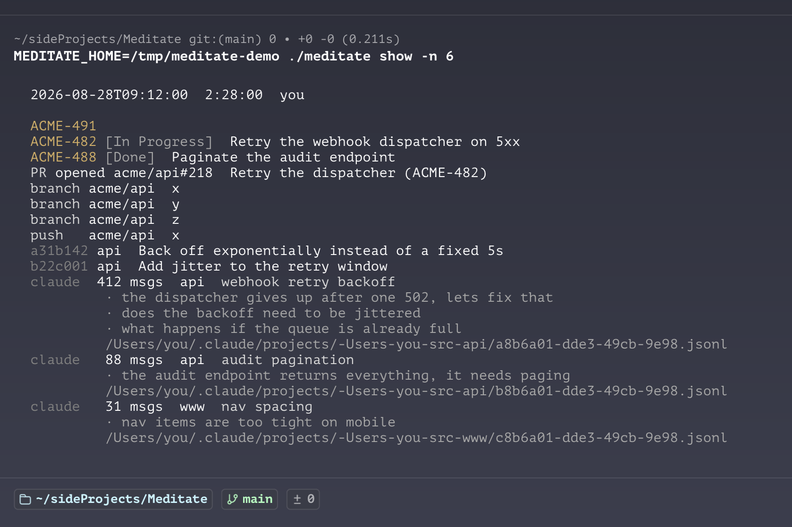

# meditate

A pomodoro-style timer you start from your terminal, that automatically
tracks your activity and organises it by session. Use it for a personal
meditation session, or for your flow and productivity at work.

It counts down and plays a gong at intervals. When the session ends it
asks your tools what happened while you sat and writes it down, with
nothing for you to fill in: the commits, pull requests, issues and Claude
Code sessions from that window, alongside how long you sat and how much
of it you were at the keyboard.

Plenty of things time a work session. The part worth having is the record
of what came out of it.

The sound is a zen gong. I use it the way tingsha are used in Buddhist
meditation, to mark the intervals and bring my attention back to the
session.



## Quick start

```
git clone https://github.com/CamdenParsons/meditate
cd meditate
./meditate 20 -i 5                              # 20 minutes, gong every 5
ln -s "$PWD/meditate" /usr/local/bin/meditate   # optional, run it anywhere
```

macOS only. Sound goes through `afplay`, and the input check reads
`HIDIdleTime` from `ioreg`. Nothing else is needed. Python 3 standard
library, no dependencies, no install step.

## Commands

```
meditate            start a session, gong every 30 min
meditate 20         a 20 minute session
meditate -i 5       gong every 5 min
meditate -e 30      expire after 30 min with no input
meditate log        past sessions
meditate show       what you did in the last one (-n 2 for the one before)
meditate bell       ring the gong once
```

`space` pauses, `q` ends. Start one in a background terminal when you sit
down and forget about it.

A session ends in one of three ways. You stop it, a fixed length runs out,
or you stop touching the machine for the expiry window. An expired session
is recorded as ending at your last input, not when the expiry fired.
Otherwise walking off at 10am and noticing at 6pm would log eight hours.

## The log

Every session appends one line to `~/.meditate/sessions.jsonl`.



*Example data, so the shapes differ. Every number in it was produced by
the real code.*

The bars are the shape of the session. Two numbers follow them.

`57% in` is how much of the session had keyboard or trackpad input,
measured once a second. Reading a diff for three minutes counts as
inactive, so this is hands-on-input time rather than engagement.

`91% even` is how evenly that input was spread. It is a description of
shape, not a score, and high is not better. It is blank on a session too
short or too still for the arithmetic to mean anything.

A `~` marks one that expired because you walked away.

The second line rolls up what the session touched. To see the individual
records, expand one session with `meditate show`.

Once a second the app records whether there was input, and when. It never
records which keys, which is why it needs no permission and captures no
content.

### Input is presence, not focus

Twenty minutes reading a diff and four minutes typing scores badly here.
A bad afternoon fighting a flaky test scores well. If most of your code is
now written by an agent, hands on the keyboard measures something closer
to how much correcting you are doing.

So do not read `% in` as productivity. It answers a narrower question,
were you at the machine, and it is worth having for narrower reasons: it
is what lets a session expire at your last keystroke instead of logging
the hours you spent at lunch, and it is the original question this tool
was built to answer, where the goal was to sit still and not touch
anything.

What a session produced is the useful half. That is what `meditate show`
is for.

`meditate show` opens a single session and lists everything attributed to
it:



All of it is read from traces your work already leaves. There is nothing
to fill in.

Attribution is by time window. Whatever your accounts did between the
session opening and its recorded end is what gets stored.

## Activity providers

When a session ends, each provider is asked what it saw during that
window. Every one is best-effort. A provider that fails, or that finds
nothing, is skipped and the session is still recorded.

| provider  | what it answers                                  | needs            |
|-----------|--------------------------------------------------|------------------|
| `claude`  | Claude Code sessions active in the window        | nothing          |
| `github`  | pushes, PRs, reviews, comments, branches         | `gh` logged in   |
| `commits` | local commits, including unpushed ones           | nothing          |
| `linear`  | issues you updated, with title and status        | `LINEAR_API_KEY` |
| `tickets` | ids mentioned in branches, commits and PR titles | nothing          |

Settings live in `~/.meditate/.env`. See [`.env.example`](.env.example).

Adding a source means writing a module with a `name` and a
`collect(window, found)`, then listing it in `medcore/activity/__init__.py`.

## Layout

```
meditate          entry point
medcore/
  session.py      a Session: when it ends, what it records
  activity/       what you did: one module per source
  config.py       settings, read from .env
  presence.py     per-second presence, and its summary
  inputwatch.py   how long since the human last touched the machine
  audio.py        striking the gong
  store.py        reading and writing the log
  display.py      drawing to the terminal
  cli.py          argument parsing and the terminal loop
art/              ascii art shown above the clock
scripts/          build-time art generation
tests/            component tests, on a fake clock
```

`session.py` and `presence.py` take their clock and input source as
arguments, so the ending rules and the hour-long expiry are tested in
milliseconds. Run the tests with `python3 -m unittest discover -s tests`.

## Common use cases

**A meditation sit.** `meditate 20 -i 5` gives you twenty minutes with a
gong every five. The goal is to take as few actions as possible, and the
percentage afterwards tells you whether you managed it.

**A pomodoro block.** `meditate 25 -i 0` runs twenty five minutes with
nothing interrupting, then `meditate show` tells you what came out of it.

**Open-ended deep work.** `meditate` on its own runs until you stop it,
with a gong every thirty minutes. If you get pulled away and forget about
it, it expires after an hour and records only the time you were there.

**Reviewing the week.** `meditate log` shows every session, how present
you were in each, and which tickets they touched.

**Answering "what was I doing".** `meditate show -n 3` opens the third
session back and lists the commits, pull requests and Claude sessions from
that window.
